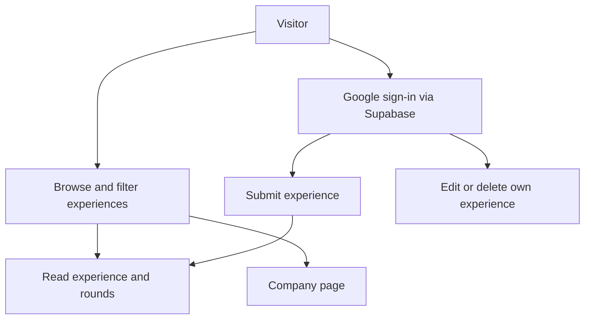
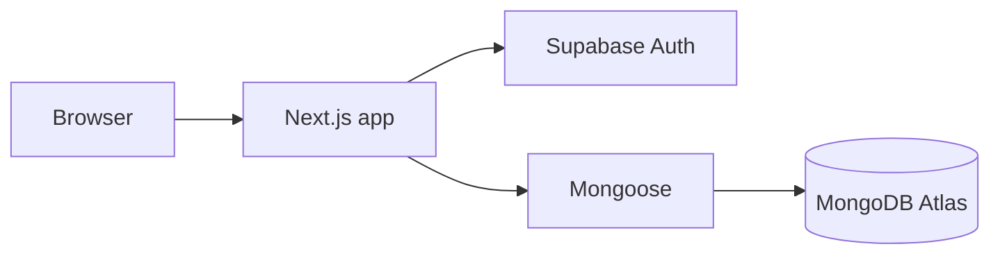

# Seniorly development plan

Day 1 (Next.js, TypeScript, Tailwind, and the README) is already in the repo. The first version is one full-stack app that makes this loop real: **submit a structured experience → store it → search and read it**. Everything else is sequenced after that loop works.

Target pace: about **22 working days**, with days 23–25 as buffer. Each day below is split into subtasks. **One subtask is one git commit.** Finish that slice, check it, commit, then start the next. Do not batch a whole day into a single commit.

## Stack update

Next.js and TypeScript stay. Data moves to **MongoDB Atlas**. Sign-in moves to **Supabase Auth (Google only)**.

This fits Seniorly. An interview experience is one document: basics, preparation, and a nested list of rounds and questions. The detail page is a single read. Atlas’s free cluster (M0) is enough for a campus-scale collection, which is why Mongo is a practical host here.

Supabase is used for authentication, session cookies, and the Google provider setup. Application data stays in MongoDB. Supabase’s built-in Postgres, Row Level Security, and database hosting are left unused so there is one source of truth for experiences.

Hosting is three free tiers, each doing one job:

- **Vercel** runs the Next.js app
- **Supabase** runs Google sign-in
- **MongoDB Atlas** stores colleges, companies, profiles, and experiences

Authorization (who may edit a post) lives in Next.js route handlers, because Supabase policies cannot see Mongo documents. Every write checks the Supabase user id against `authorId`.

## 1. Product requirements

Seniorly is a searchable record of real campus interview experiences, starting with IIIT Kottayam students, without baking that college into the code.

An experience must capture company, role, internship vs full-time, college, branch, graduation year, interview year, optional selection status, one or more rounds (type, duration, questions, topics, difficulty, notes), and optional preparation (how they prepared, topics, resources, advice).

Readers must find experiences by company, role, and keyword, and narrow them by opportunity type, year, branch, and college. Round-type filter is included once rounds exist, because it is the same query, not a new product.

Writers must create and later edit their own experience without a long mandatory form. Preparation and selection status stay optional.

## 2. MVP scope

**In the first version**

- Google sign-in through Supabase Auth
- Create, edit, and delete your own experience
- Dynamic rounds and questions (at least one round, at least one question in that round)
- Public list, filters, keyword search, and a detail page
- Colleges and companies as real records, with IIIT Kottayam and a small company set seeded
- A simple company page that lists that company’s experiences (the dedicated analytics page is not built)
- Server-side validation and clear form errors

**Explicitly later** (not in the 22-day build unless buffer remains): upvotes, comments, bookmarks, profiles beyond name/college, follow, notifications, recommendations, FAQ aggregation, roadmaps, stats, AI search, reporting workflows, reputation, and a full admin console.

**Light admin, only if buffer remains:** a `role` field on the Mongo user profile and a page that lists experiences. No report queue.

## 3. User flows

- **Prepare:** open home or `/experiences`, search “HPE Software Engineer”, filter year/branch/type, open a result, read rounds and advice. No account required.
- **Share:** sign in, `/experiences/new`, fill basics, add rounds, optionally add preparation, submit, land on the new detail page. Incomplete required fields stay on the form with field errors. The draft is not saved server-side in v1 (local-only recovery is a later nicety).
- **Correct:** author opens edit, changes rounds, saves. Another user does not see edit/delete.

## 4. Feature breakdown

- **Identity:** Supabase session, “signed in as”, sign out. A small Mongo profile (branch, graduation year, college) is optional and prefills the form.
- **Catalog:** `colleges` and `companies` collections. Role is free text on the experience (`Software Engineer`), not a managed role catalog. A role collection can wait until the same title needs a canonical page.
- **Experience editor:** one page, three sections (basics, rounds, preparation). Add/remove/reorder rounds and questions in the browser, then one submit.
- **Discovery:** query params on the list (`q`, `company`, `role`, `type`, `year`, `branch`, `college`, `round`). Shareable URLs.
- **Company page:** `/companies/[slug]` shows name and matching experiences. Common rounds, FAQ aggregates, and stats are aggregation-pipeline queries we can add later on the same documents.

## 5. Technology decisions

**App: Next.js (App Router) + TypeScript.** One codebase, server-rendered list and detail pages (good for shareable links), route handlers for writes. Alternatives: separate React + Express (two deploys, more wiring) or Django (faster admin, weaker fit if the UI is the product). A monolith is the right size for one developer and ~3 weeks.

**UI: refer to ./SENIORL_MOTION_INTERACTION_SPEC.md**

**Database: MongoDB Atlas + Mongoose.** Experiences embed rounds and questions, so a save is one atomic insert and a detail view is one read. Filters use indexes on college, company, year, branch, opportunity type, and `rounds.roundType`. Alternatives considered: Postgres + Prisma (stronger foreign keys, extra join or child tables for rounds) and the raw Mongo driver (less schema in code). Mongoose keeps indexes and document shape next to the app. Prisma’s Mongo connector is a weaker fit than Mongoose for this document model.

**Where it runs:** Atlas M0 for dev and production. A local Mongo instance is fine if you already have one; the connection string is the only switch. Atlas M0 is a replica set, so multi-document transactions are available, but v1 rarely needs them because a new experience is a single insert after the company document exists.

**Auth: Supabase Auth with the Google provider, via `@supabase/ssr`.** The Supabase dashboard holds the Google client id and secret and the redirect URLs. The app only reads the session. Alternatives: Auth.js in the Next.js app (one less vendor, more OAuth wiring) and email/password (password reset and storage). Google through Supabase is the simplest secure setup for this project.

**Validation: Zod schemas** shared by the form and the route handlers. Mongoose schema mirrors the same shape so bad writes fail even if a handler skips Zod.

**Search:** indexed equality filters, case-insensitive regex or anchored match on role and company name, and a MongoDB text index on `roleTitle`, question prompts, and advice for the `q` parameter. A dedicated search engine waits until ranking actually matters.

**Tests:** Vitest for Zod and for the filter-to-query mapper (pure function, no database). Browser click-through of submit and search before calling a milestone done. Playwright can wait until the flows stop changing.

## 6. System architecture

No separate API service, queue, cache, or search cluster. Reads go through Server Components. Writes go through Route Handlers that load the Supabase user, validate with Zod, and write through Mongoose.

Supabase is not queried for experiences. Mongo is not used to verify Google tokens; `supabase.auth.getUser()` does that on the server.

## 7. Database schema

Collections:

- **colleges** — `name`, `slug` (unique), `shortName`, optional `emailDomain` (for example `iiitkottayam.ac.in`). Seed `iiit-kottayam`. No college logic in `if (college === "IIITK")` branches.
- **companies** — `name`, `normalizedName` (unique), `slug` (unique), optional `website`. The API finds-or-creates by normalized name so HPE is not blocked on an admin list. Slug collisions get a numeric suffix.
- **users** — `_id` is the Supabase user UUID (string). `email`, `name`, `image`, `role` (`student` default, `admin` unused until buffer), optional `collegeId`, `branch`, `graduationYear`.
- **experiences** — one document:
  - `authorId` (Supabase user id)
  - `collegeId`, plus denormalized `collegeSlug` and `collegeName` for list cards
  - `companyId`, plus denormalized `companySlug` and `companyName`
  - `roleTitle`, `opportunityType` (`internship` | `full_time`)
  - `branch`, `graduationYear`, `interviewYear`
  - optional `selectionStatus` (`selected` | `rejected` | `in_progress` | `offer_declined`)
  - optional `preparation`, `focusTopics`, `resources`, `advice`
  - `rounds`: array of `{ position, roundType, title, durationMinutes, difficulty, notes, topics: string[], questions: [{ position, prompt }] }`
  - `roundTypes`: string array copied from rounds so “filter by technical round” is a simple index match
  - `createdAt`, `updatedAt`

`roundType`: `online_assessment` | `technical` | `managerial` | `hr` | `other`. `difficulty`: `easy` | `medium` | `hard`.

Edits replace the `rounds` array on that document. Deleting the experience removes rounds and questions with it, because they are embedded.

Indexes:

- unique `colleges.slug`, `companies.slug`, `companies.normalizedName`
- `experiences`: `companySlug`, `collegeSlug`, `interviewYear`, `opportunityType`, `branch`, `authorId`, `roundTypes`
- text index on `roleTitle`, `rounds.questions.prompt`, `advice`, `preparation`

Denormalized names are rewritten if a company or college rename ever happens. v1 does not rename them.

## 8. API design

Session cookie from Supabase, not a public API token.

- `GET /api/experiences` — list with the filters above. Returns cards (company, role, type, year, branch, college, round count), not every question body.
- `POST /api/experiences` — signed-in create.
- `GET /api/experiences/[id]` — full experience. The page loads via Mongoose in a Server Component; the GET handler calls the same function so the contract stays testable.
- `PATCH /api/experiences/[id]` — author only.
- `DELETE /api/experiences/[id]` — author only.
- `GET /api/companies?q=` — typeahead for the form.
- `GET /api/colleges` — form select.

Shared query and write functions live in `lib/experiences.ts`. Route handlers stay thin.

Error body: `{ error: { code, message, fieldErrors? } }` with 400 validation, 401 unauthenticated, 403 not author, 404 missing.

## 9. Authentication and authorization

**MVP auth: Supabase Google provider.**

Setup when implementation starts:

- Create a Supabase project and enable the Google provider (Google Cloud OAuth client, redirect URL from the Supabase dashboard).
- Add `@supabase/supabase-js` and `@supabase/ssr`.
- Browser client, server client, and middleware that refreshes the session cookie.
- `/signin` starts `signInWithOAuth({ provider: 'google' })`.
- Route handlers call `getUser()` and reject missing users with 401.

**Rules**

- Read experiences: public. List and detail pages do not require a session.
- Create: signed in.
- Edit/delete: `experience.authorId === supabaseUser.id`.
- College lock: not in v1. `colleges.emailDomain` is already on the document.

On first sign-in, upsert the Mongo `users` document. If the Google email domain matches a college’s `emailDomain`, set `collegeId`. Seed IIIT Kottayam with its student domain when confirmed (often `iiitkottayam.ac.in`). Other domains still get an account; college is chosen on the form. Personal Gmail accounts can still contribute.

## 10. Frontend architecture

App Router routes:

- `/` — short explanation and a search box that routes to the list
- `/experiences` — results and filters (URL state)
- `/experiences/[id]` — rounds, questions, preparation
- `/experiences/new` and `/experiences/[id]/edit` — client form, signed-in
- `/companies/[slug]` — company header + experience list
- `/signin` — Google button

`components/` for form sections, experience card, filters. `lib/validators/experience.ts` for Zod. Server Components fetch data; the form is a client component because rounds are dynamic.

Keep the form short: required fields are company, role, opportunity type, college, branch, interview year, and one round with a type and one question. Everything else is optional and visually secondary.

## 11. Backend architecture

Suggested layout:

- `app/` — routes and route handlers
- `lib/db.ts` — cached Mongoose connection (important on serverless, or each invocation opens a new pool)
- `lib/supabase/client.ts`, `server.ts`, `middleware.ts` — Supabase session helpers
- `lib/models/` — College, Company, User, Experience
- `lib/experiences.ts` — list/get/create/update/delete used by pages and handlers
- `lib/validators/` — Zod
- `scripts/seed.ts` — colleges, companies, sample experiences for local/dev only

No service layer beyond `lib/experiences.ts` until a second caller appears. Create finds or inserts the company, then inserts one experience document. A failed experience insert may leave a newly created company row; that is acceptable. The experience document itself cannot be half-saved, because rounds live inside it.

## 12. Validation and error handling

- Zod on the server is the source of truth. The client uses the same schema so errors show next to fields.
- Bounds: role and question length caps, at most 8 rounds and 15 questions per round, interview year in a sane range (for example 2018 through next calendar year).
- Company name trimmed; slug generated from the name; unique collision gets a numeric suffix.
- Empty optional text is stored as `null` or omitted.
- Delete confirms in the UI. Failed saves show the API message and keep the form values.
- Invalid ObjectIds on `/experiences/[id]` return 404.

## 13. Testing

Per milestone, not a big test phase at the end:

- Zod: rejects missing question, accepts minimal experience, strips empty preparation.
- Filter mapper: company + year + round type builds the expected Mongo query object, including `roundTypes`.
- Manual: signed-out user cannot open the form; author can edit; other user cannot; search URL for a seeded HPE experience opens the right detail.

## 14. Deployment

**Vercel (app) + MongoDB Atlas (data) + Supabase (Google auth).**

Environment variables:

- `MONGODB_URI`
- `NEXT_PUBLIC_SUPABASE_URL`
- `NEXT_PUBLIC_SUPABASE_ANON_KEY`

The anon key is safe in the browser only because writes do not trust the client: route handlers re-check the user, and Mongo is reached with a server-side URI that is never public. Do not put `MONGODB_URI` in a `NEXT_PUBLIC_` variable.

In the Supabase dashboard, allow redirect URLs for `http://localhost:3000` and the Vercel domain. In Google Cloud, the OAuth client’s authorized redirect is the Supabase callback URL, not the Next.js app URL.

Ship only after create, list, and detail work locally. README at deploy time documents env vars and `scripts/seed.ts`. Production seed inserts colleges and companies only. Sample experiences stay in development.

## 15. Monitoring

V1: Vercel function logs. Failed writes return the standard error body and omit stack traces. Atlas’s built-in metrics cover connection count and slow queries on the free cluster. Sentry or uptime checks wait until the app has real users.

## 16. Future scalability

Already compatible with later colleges: a `colleges` document, slug URLs, no hardcoded campus checks. Later, college-scoped default filters and an optional “verified student” flag can use `emailDomain` without rewriting experiences.

Company pages already have a URL. Aggregates (common round types, frequent topics) are a Mongo aggregation on the embedded `rounds` array when there is enough data.

When search quality matters, tune the text index or add Atlas Search. A second database or a move back to Postgres is unnecessary unless you later want Supabase Row Level Security to be the authorization layer. That would mean migrating documents into Supabase Postgres, which is a later decision, not an MVP concern.

---

## Recommended choices (summary)

- **Stack:** Next.js + TypeScript + Tailwind (Night library theme) + Mongoose + MongoDB Atlas + Supabase Auth (Google) + Zod
- **Theme:** olive-black `#121410`, warm off-white text, brass `#d4c4a0` accent, Newsreader headings, Source Sans 3 for UI and reading
- **Structure:** single repo, `app/`, `lib/models/`, `lib/supabase/`, `lib/experiences.ts`, `scripts/seed.ts`
- **Database:** MongoDB. Collections: colleges, companies, users, experiences. Rounds and questions embedded on the experience.
- **API:** REST route handlers under `/api/experiences`, `/api/companies`, `/api/colleges`, plus Server Components for pages
- **Auth:** Supabase Google sign-in; college domain linkage on the Mongo profile; public read; author-only writes checked in route handlers
- **Frontend:** server-rendered browse/detail; client form for rounds
- **Deploy:** Vercel + Atlas + Supabase after the core loop works

## Daily subtasks (one commit each)

Suggested message shape: `add mongoose connection`, `add college model`. Keep the subject specific to that slice.

### Day 1 — Scaffold (done)

Already committed as the Next.js app, Tailwind, lint, and the short project README.

### Day 2 — Mongo connection

1. Add `mongoose` and confirm `.env.local` is gitignored. Commit: `add mongoose`.
2. Add `lib/db.ts` with a cached connection so serverless calls reuse one client. Commit: `cache the mongoose connection`.
3. Add `GET /api/health` that connects and returns ok or a short failure. Commit: `add mongo health check`.

### Day 3 — Models

1. Add shared enums (opportunity type, round type, difficulty, selection status) in `lib/models/enums.ts`. Commit: `add experience field enums`.
2. Add the College model (`slug` unique, optional `emailDomain`). Commit: `add college model`.
3. Add the Company model (`slug` and `normalizedName` unique). Commit: `add company model`.
4. Add the User profile model (`_id` is the Supabase user id). Commit: `add user profile model`.
5. Add the Experience model with embedded rounds and questions, denormalized college/company fields, `roundTypes`, and indexes. Commit: `add experience model`.

### Day 4 — Seed data

1. Add `lib/slug.ts` to trim a name, build a slug, and suffix it on collision. Commit: `add slug helper`.
2. Add `scripts/seed.ts` and an npm script that connects and upserts IIIT Kottayam. Commit: `seed iiit kottayam`.
3. Upsert a few companies, including HPE. Commit: `seed companies`.
4. Upsert 2–3 sample experiences with rounds and questions, marked so they can be skipped in production later. Commit: `seed sample experiences`.

### Day 5 — Validation

1. Add Zod. Commit: `add zod`.
2. Add `lib/validators/experience.ts` for the required basics (company, role, type, college, branch, interview year). Commit: `validate experience basics`.
3. Extend the schema for rounds and questions: at least one round, one question, max 8 rounds and 15 questions, year bounds, empty optional text becomes null. Commit: `validate rounds and questions`.
4. Add Vitest. Commit: `add vitest`.
5. Add tests: reject a missing question, accept a minimal experience, strip empty preparation. Commit: `test experience validation`.

### Day 6 — Google sign-in

1. Add `@supabase/supabase-js` and `@supabase/ssr`. Commit: `add supabase auth packages`.
2. Add the browser Supabase client. Commit: `add supabase browser client`.
3. Add the server Supabase client. Commit: `add supabase server client`.
4. Add middleware that refreshes the session cookie. Commit: `refresh the supabase session`.
5. Add `/signin` with a Google button. Commit: `add google sign-in page`.
6. Add sign-out. Commit: `add sign out`.
7. Add a signed-in-only placeholder at `/experiences/new`. Commit: `protect the new experience page`.

### Day 7 — Profile and college link

1. Add `lib/users.ts` to upsert a Mongo profile from the Supabase user. Commit: `upsert user profile on sign-in`.
2. If the email domain matches a college `emailDomain`, set `collegeId` on that upsert. Commit: `link college from email domain`.
3. Show the signed-in name in the header. Commit: `show signed-in user`.

### Day 8 — Create experience API

1. Add `lib/auth.ts` with `requireUser()` that returns the Supabase user or a 401. Commit: `require a signed-in user`.
2. Add find-or-create company by normalized name. Commit: `find or create company`.
3. Add `createExperience` in `lib/experiences.ts`: validate, copy college/company names onto the document, set `roundTypes`, insert once. Commit: `create an experience document`.
4. Add `POST /api/experiences` as a thin wrapper. Commit: `add create experience route`.

### Day 9 — Form basics

1. Add shared field styles: label, input, select, primary button, field error. Commit: `add form field styles`.
2. Load colleges into the form select. Commit: `add college select`.
3. Add company typeahead against `GET /api/companies?q=` (the route can return seeded companies; create-on-submit stays on day 8’s API). Commit: `add company typeahead`.
4. Add the rest of the basics fields: role, opportunity type, branch, years, optional selection status. No submit yet. Commit: `add experience basics fields`.

### Day 10 — Rounds on the form

1. Add form state for one default round and its first question. Commit: `hold rounds in form state`.
2. Add and remove rounds, up to 8. Commit: `add and remove rounds`.
3. Add and remove questions inside a round, up to 15. Commit: `add and remove questions`.
4. Add round type, title, duration, difficulty, topics, and notes on each round. Commit: `edit round details`.

### Day 11 — Preparation and submit

1. Add optional preparation, focus topics, resources, and advice. Commit: `add preparation fields`.
2. Run the Zod schema in the browser and show errors next to fields. Commit: `show field errors on the form`.
3. Submit with `POST /api/experiences` and keep typed values when the request fails. Commit: `submit a new experience`.
4. On success, redirect to `/experiences/[id]`. A plain “saved” page is fine until the detail page exists. Commit: `redirect to the new experience`.

### Day 12 — Experience list

1. Add `listExperiences` returning card fields only (no question text). Commit: `list experience cards`.
2. Add the experience card component. Commit: `add experience card`.
3. Add `/experiences` and render seeded cards. Commit: `add experiences page`.

### Day 13 — Filters

1. Add a pure function that turns URL search params into a Mongo filter, including `roundTypes`. Commit: `map filters to a query`.
2. Add company, role, type, year, branch, and college controls that write those params. Commit: `filter experiences from the url`.
3. Add the `q` keyword param on the text index fields. Commit: `search experiences by keyword`.
4. Add the round-type filter. Commit: `filter by interview round`.

### Day 14 — Detail page

1. Add `getExperience` and treat a bad id as missing. Commit: `load one experience`.
2. Render company, role, college, year, and selection status. Commit: `add experience summary`.
3. Render rounds, topics, difficulty, and questions. Commit: `show interview rounds`.
4. Render preparation and advice when present. Commit: `show preparation notes`.

### Day 15 — Home and empty states

1. Replace the default home with a short Night library intro and the Seniorly name. Commit: `add the home page`.
2. Add a search box that routes to `/experiences?q=`. Commit: `search from the home page`.
3. Add an empty state on the list when nothing matches. Commit: `add an empty results state`.

### Day 16 — Edit and delete

1. Add `updateExperience` that replaces `rounds` only when `authorId` matches. Commit: `update an experience`.
2. Add `PATCH /api/experiences/[id]`. Commit: `add update experience route`.
3. Add `deleteExperience` and `DELETE /api/experiences/[id]`, author only. Commit: `add delete experience route`.
4. Add `/experiences/[id]/edit` by reusing the form, prefilled. Commit: `add the edit experience page`.
5. Show edit and delete only to the author, with a confirm step before delete. Commit: `let the author edit or delete`.

### Day 17 — Company page

1. Add `getCompanyBySlug`. Commit: `load a company by slug`.
2. Add `/companies/[slug]` with the name and its experience cards. Commit: `add the company page`.
3. Link company names on cards and the detail page to that route. Commit: `link to company pages`.

### Day 18 — Errors

1. Add `lib/api-error.ts` for `{ error: { code, message, fieldErrors? } }` and 400, 401, 403, 404. Commit: `add a shared api error`.
2. Use it on create, update, and delete. Commit: `return consistent write errors`.
3. Return 403 when a signed-in user edits or deletes someone else’s experience. Commit: `forbid edits by other users`.
4. Return 404 for a missing or invalid experience id on the page and the API. Commit: `return 404 for a missing experience`.

### Day 19 — Tests and a manual pass

1. Test the filter mapper: company + year + round type includes `roundTypes`. Commit: `test experience filters`.
2. Walk through signed-out (cannot open the form), author (can edit), and another user (no edit or delete). Fix only what that pass breaks, as its own commit. Commit: `fix issues found in the auth pass`.

### Day 20 — Layout polish

1. Add loading states for the list and the detail page. Commit: `add loading states`.
2. Check the form, list, and detail on a narrow viewport and fix overflow. Commit: `make the main pages usable on a phone`.

### Day 21 — Deploy prep

1. Add `.env.example` with `MONGODB_URI`, `NEXT_PUBLIC_SUPABASE_URL`, and `NEXT_PUBLIC_SUPABASE_ANON_KEY`. Commit: `add env example`.
2. Teach the seed script to skip sample experiences when `SEED_SAMPLES` is not set. Commit: `skip sample experiences in production seed`.
3. Document the three hosts and the seed command in the README. Commit: `document deployment setup`.

### Day 22 — Deploy

1. Create the Vercel project, Atlas database, and Supabase Google provider, and set the env vars and redirect URLs. This is dashboard work; commit only if a config file changes. Commit if needed: `configure production redirects`.
2. Deploy and smoke-test sign-in, create, search, and edit. Each fix is its own commit.

### Days 23–25 — Buffer, pick one

Do these only if the loop above already works. One commit per item.

1. Confirm IIIT Kottayam’s real student email domain on the college document. Commit: `set the iiit kottayam email domain`.
2. Tighten empty-state and form copy. Commit: `clarify empty and form copy`.
3. Add a minimal admin list of experiences, visible only when `user.role` is `admin`. Commit: `add an admin experience list`.

